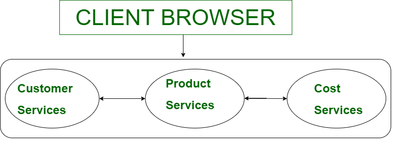

**What is a microservice?**

Ans. Microservices - also known as the microservice architecture - is an architectural style that structures an application as a collection of services that are

    Independently deployable
    Loosely coupled
    Organized around business capabilities
    Owned by a small team
    Highly maintainable and testable

The microservice architecture enables the rapid, frequent and reliable delivery of large, complex applications. It also enables an organization to have their own technology stack, inclusive of the database and data management model,
communicate with one another over a combination of REST APIs.

Code can be updated more easily - new features or functionality can be added without touching the entire application
Teams can use different stacks and different programming languages for different components.


**What is a monolith architecture?**

Ans. Monolithic Architecture is like a big container, wherein all the software components of an app are assembled and tightly coupled, i.e., each component fully depends on each other. 

Let’s take an example of an e-commerce site-




As you can see in the example all the services provided by the application (Customer Services, Cost Services, Product Services) are directly connected. So if we want to change in code or something we have to change in all the services as well.

    For large and complex application in monolithic, it is difficult for maintenance because they are dependent on each other.

    It is because, for modify an application we have to redeploy whole application instead of updates part. It takes more time or slow development.

    Each copy of the application will access the hole data which make more memory consumption. 

    If one services goes down, then it affects all the services provided by the application. It is because all services of applications are connected to each other.

    Really difficult to adopt new technology.It is because we have to change hole application technology.


**Que. What is the difference between Monolith and Microservices?**

Ans. 

1.) Monolithic architecture is built as one large system and is usually one code-base.
    Microservices architecture is built as small independent module based on business functionality.

2.) It is not easy to scale Monolithic application based on demand.
    It is easy to scale Microservices based on demand.

3.) Monolithic architecture has shared database.
    In Microservices architecture, Each project and module has their own database.

4.) In Monolithic architecture, Large code base makes IDE slow and build time gets increase.
    In Microservices architecture, Each project is independent and small in size. So overall build and development time gets decrease.

5.) It extremely difficult to change technology or language or framework in Monolithic application because everything is tightly coupled and depend on each other.
    In Microservices architecture, it is Easy to change technology or framework because every module and project is independent
    


**Que. Why do we need a useEffect Hook?**

Ans. By using this Hook, you tell React that your component needs to do something after render. React will remember the function you passed (we’ll refer to it as our “effect”), and call it later after performing the DOM render or updates. In this effect, we set the document title, but we could also perform data fetching or call some other imperative API.

useEffect exists: to provide a way to handle performing these side effects,

    Making a request to an API for data from a backend server
    To interact with browser APIs (that is, to use document or window directly)
    Using unpredictable timing functions like setTimeout or setInterval

```_In short, useEffect is a tool that lets us interact with the outside world but not affect the rendering or performance of the component that it's in._```.


**Que. What is Shimmer UI?**

Ans. A shimmer UI resembles the page's actual UI, so users will understand how quickly the web or mobile app will load even before the content has shown up. It gives people an idea of what's about to come and what's happening (it's currently loading) when a page full of content/data takes more than 3 - 5 seconds to load.


**Que. what is optional chaining?**
Ans. Optional chaining is a safe and concise way to perform access checks for nested object properties.
`The optional chaining operator ?. takes the reference to its left and checks if it is undefined or null. If the reference is either of these nullish values, the checks will stop and return undefined. Otherwise, the chain of access checks will continue down the happy path to the final value.`

    Optional chaining is a useful feature that can help you write cleaner code.

    obj?.prop       // optional static property access
    obj?.[expr] // optional dynamic property access
    func?.(...args) // optional function or method call


**Que. what is the difference between JS expression and JS statement ?**
Ans.   An expression produces a value and can be written wherever a value is expected, for example as an argument in a function call. 

    1 → produces 1
    "hello" → produces "hello"
    5 * 10 → produces 50
    num > 100 → produces either true or false
    isHappy ? "🙂" : "🙁" → produces an emoji
    [1, 2, 3].pop() → produces the number 3


A statement performs an action.

    let hi = 5;

    if (hi > 10) {
        // More statements here
    }

**Que. what is conditional Rendering, explain with a code example?**
Ans.    In React, you can create distinct components that encapsulate behavior you need. Then, you can render only some of them, depending on the state of your application.
Use JavaScript operators like `if` or the `conditional operator` to create elements representing the current state, and let React update the UI to match them.

Ex. - 
    function Greeting(props) {
    const isLoggedIn = props.isLoggedIn;
    if (isLoggedIn) {
        return <UserGreeting />;
    }
    return <GuestGreeting />;
    }

an Inline expression is  -

    online = true;

    {online ? <Body> : <Shimmere/> }


**Que. what is CORS ?**
Ans. Cross-Origin Resource Sharing (CORS) is an HTTP-header based mechanism that allows a server to indicate any origins (domain, scheme, or port) other than its own from which a browser should permit loading resources.

For security reasons, browsers restrict cross-origin HTTP requests initiated from scripts. For example, XMLHttpRequest and the Fetch API follow the same-origin policy. This means that a web application using those APIs can only request resources from the same origin the application was loaded from unless the response from other origins includes the right CORS headers.


**Que. what is async and await ?**
Ans. The async function declaration declares an async function where the await keyword is permitted within the function body. The async and await keywords enable asynchronous, promise-based behavior to be written in a cleaner style, avoiding the need to explicitly configure promise chains.

    Async functions can contain zero or more await expressions. Await expressions make promise-returning functions behave as though they're synchronous by suspending execution until the returned promise is fulfilled or rejected. The resolved value of the promise is treated as the return value of the await expression. Use of async and await enables the use of ordinary try / catch blocks around asynchronous code.

    The await keyword is only valid inside async functions within regular JavaScript code. If you use it outside of an async function's body, you will get a SyntaxError.

    Async functions always return a promise. If the return value of an async function is not explicitly a promise, it will be implicitly wrapped in a promise.


**Que. what is the use of `const json = await data.json();` in getRestaurants() ?**
Ans. Async functions always return a promise.
    This promise is resolving by  `await data.json();`.
    Here json() methods is used for parsing JavaScript Object Notation (JSON) and converting values to JSON. It converts data in key-value pairs and arrays, with the keys serving as names and the values containing related data.
